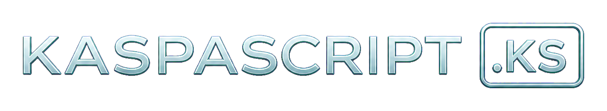

<p align="center">
  
</p>

<p align="center">
  <strong>A readable, deterministic language and toolkit for programmable UTXOs on Kaspa.</strong>
</p>

<p align="center">
  Write contract intent in <code>.ks</code>. Inspect the UTXO transition model. Compile source-grounded txscript. Package everything wallets, indexers, SDKs, and applications need to understand it.
</p>

<p align="center">
  <a href="#quick-start">Quick Start</a> ·
  <a href="#what-kaspascript-does">What It Does</a> ·
  <a href="#example">Example</a> ·
  <a href="#current-status">Status</a> ·
  <a href="https://gryszzz.github.io/Kaspa-Script/">Project Site</a>
</p>

<p align="center">
  
  
  
  
  
</p>

---

## What Is KaspaScript?

KaspaScript is a Rust-based language, compiler, and programmability toolkit for
expressing Kaspa-native UTXO behavior without writing raw txscript opcodes.

It is designed around how Kaspa actually works:

- UTXOs and explicit value movement
- deterministic scripts and artifacts
- transaction-level input and output constraints
- signatures, timelocks, hashlocks, and multisig
- covenant lineage and state-transition modeling
- BlockDAG-aware finality and sequencing assumptions
- wallet signing intent and indexer interpretation
- target-specific protocol evidence and readiness gates

KaspaScript is not an Ethereum-style account runtime, and it does not pretend
that preview or testnet capabilities are active on mainnet.

```text
Readable .ks source
        ↓
Semantic checks and typed constraints
        ↓
Canonical UTXO application model
        ↓
Typed opcode-agnostic IR
        ↓
Target-gated Kaspa txscript
        ↓
Deterministic artifact and kernel package
        ↓
Wallet · SDK · Indexer · Node · Application
```

## Quick Start

### Prerequisites

- Rust 1.80 or newer
- Git

### Build The Project

```bash
git clone https://github.com/gryszzz/Kaspa-Script.git
cd Kaspa-Script
cargo build --workspace
```

### Explore A Contract

Start with the included escrow contract:

```bash
cargo run -p kaspascript-cli -- \
  inspect tests/contracts/escrow.ks
```

KaspaScript explains the important parts:

```text
contract Escrow
  transition release
    signing: 2-of-3 multisig
    require: output(0).value >= input(0).value
    fees/change: external and explicit

  transition refund
    signing: buyer
    require: block.height >= timeout
    require: output(0).script == buyer
```

### Compile It

```bash
cargo run -p kaspascript-cli -- \
  compile tests/contracts/escrow.ks \
  --target verified-tn12 \
  --output /tmp/escrow.artifact.json
```

The artifact contains deterministic bytecode plus the application model,
signing intent, source hash, target, KIP requirements, and warnings.

### Build An Application Package

```bash
cargo run -p kaspascript-cli -- \
  kernel package tests/contracts/escrow.ks \
  --target verified-tn12 \
  --compute-grams 1000 \
  --tx-bytes 400 \
  --output /tmp/escrow.kernel.json
```

The kernel package adds wallet previews, capability profiles, indexer
requirements, fee assumptions, source evidence, and network readiness.

## What KaspaScript Does

| Surface | What you get |
| --- | --- |
| Language | Readable `.ks` contracts with typed parameters and explicit spend paths. |
| Compiler | Lexer, parser, semantic analysis, typed IR, target gates, and deterministic txscript. |
| Application model | Signing requirements, constraints, UTXO references, output bindings, continuation, and monetary responsibilities. |
| Inspector | Human-readable and JSON explanations of what each transition requires. |
| Kernel package | A single package for wallets, SDKs, indexers, agents, and review tools. |
| Protocol grounding | Claims tied to pinned Kaspa sources, KIPs, releases, and activation posture. |
| Verification | Golden artifacts, ASM/hex snapshots, negative tests, determinism tests, and fuzz smoke tests. |

### Design Principles

- No hidden recipients, fees, change, or monetary behavior.
- No secret-key handling in generated application logic.
- No abstraction that hides signing intent or UTXO ownership.
- No unsupported opcode invention.
- No mainnet claim beyond available evidence.
- No linear-chain assumptions where BlockDAG behavior matters.
- Every compiler output should be inspectable and explainable.

## Example

```kaspascript
contract Escrow {
  params {
    buyer: PublicKey,
    seller: PublicKey,
    arbiter: PublicKey,
    timeout: BlockHeight,
    finality_depth: 10,
  }

  spend release(sig_a: Signature, sig_b: Signature) {
    require multisig(2, [buyer, seller, arbiter], [sig_a, sig_b]);
    require output(0).value >= input(0).value;
  }

  spend refund(sig: Signature) {
    require sig.verify(buyer);
    require block.height >= timeout;
    require output(0).script == buyer;
  }
}
```

KaspaScript preserves more than bytecode. The compiled application model can
answer:

- Who can authorize `release` and `refund`?
- Which inputs and outputs are referenced?
- Which value and script constraints must hold?
- Are extra outputs still permitted?
- Does the source bind a successor state output?
- Who remains responsible for fees and change?
- What did the compiler prove, and what must a wallet or node verify?

Machine-readable inspection is available for applications and coding agents:

```bash
cargo run -p kaspascript-cli -- \
  inspect tests/contracts/escrow.ks --json
```

## Core Commands

```bash
# Explain source or a compiled artifact
kaspascript inspect contract.ks
kaspascript inspect contract.ks --json
kaspascript inspect contract.artifact.json

# Compile deterministic artifacts
kaspascript compile contract.ks --target verified-tn12

# Verify emitted bytecode
kaspascript verify contract.artifact.json

# Check readiness and assumptions
kaspascript kernel check contract.ks --target verified-tn12
kaspascript doctor contract.ks --target future-mainnet --json

# Preview wallet signing intent
kaspascript kernel preview contract.ks --transition release

# Package compiler, wallet, indexer, evidence, and fee metadata
kaspascript kernel package contract.ks \
  --target verified-tn12 \
  --compute-grams 1000 \
  --tx-bytes 400

# Inspect Toccata target and fee posture
kaspascript toccata status
kaspascript toccata targets
kaspascript toccata fee --compute-grams 1000 --tx-bytes 400
```

When developing from the repository, prefix commands with:

```bash
cargo run -p kaspascript-cli --
```

## Contract Patterns

Ready-to-study examples live in [`tests/contracts`](tests/contracts).

| Pattern | Demonstrates | Current posture |
| --- | --- | --- |
| Escrow | 2-of-3 release, timeout refund, value and script constraints | Verified TN12 subset |
| Timelock | Signature authorization after a block-height threshold | Verified TN12 subset |
| Multisig | Static threshold signatures | Verified TN12 subset |
| Atomic swap | Hashlock claim path and timeout refund | Verified TN12 subset |
| Vault | Owner/recovery paths with explicit output constraints | Verified subset, lineage future-gated |
| DAGSafe channel | Cooperative, mediated, and timeout close paths | Verified TN12 subset |
| DAGSafeVault | Covenant-oriented UTXO state-machine blueprint | TN10/kernel preview |

Committed deterministic outputs live in [`tests/golden`](tests/golden).

## How The Pieces Fit

```text
compiler/
├── lexer       source positions and tokens
├── parser      contracts, params, spends, and expressions
├── semantic    types, scopes, builtins, and finality checks
├── model       canonical Kaspa UTXO application model
├── ir          opcode-agnostic instructions
├── codegen     source-grounded txscript and artifacts
└── protocol    target manifests and feature gates

kernel/         wallet previews, capability profiles, indexer schemas,
                source evidence, fee policy, and readiness reports

sdk/            Rust compile API and preview transaction surfaces
cli/            human and JSON workflows
tests/          contracts, deterministic goldens, and integration tests
docs/           architecture, schemas, protocol audits, and roadmaps
```

The important architectural rule is simple: the compiler, kernel, CLI, SDK,
wallet integrations, and indexers should describe the same application model.

Read the deeper design:

- [KaspaScript Program Model](docs/KASPASCRIPT_PROGRAM_MODEL.md)
- [Architecture Decision: Canonical Application Model](docs/architecture/ADR-001-canonical-application-model.md)
- [Kaspa Programmability Kernel](docs/KASPA_PROGRAMMABILITY_KERNEL.md)
- [Kernel Package Schema](docs/KERNEL_PACKAGE_SCHEMA.md)

## Current Status

KaspaScript is an active developer-preview project with a verified compiler
subset and deterministic tooling.

### Available Today

- complete V1 lexer, parser, semantic checker, typed IR, and txscript backend
- canonical `kaspascript.application.v0` model
- deterministic JSON, hex, and ASM artifacts
- `verified-tn12`, `tn10-toccata`, `toccata-preview`, and `future-mainnet` gates
- wallet previews and signing-intent metadata
- kernel packages and versioned JSON report schemas
- offline SDK and feature-gated testnet harnesses

### Intentionally Gated

- production covenant-ID lowering
- production ZK verifier lowering
- script-visible sequencing flows
- complete Rusty Kaspa transaction construction and broadcasting
- production mainnet treatment

`future-mainnet` remains blocked until activation, source compatibility,
wallet/indexer assumptions, and fee behavior are independently verified.

See [Project Status](docs/PROJECT_STATUS.md) for the current roadmap and
[Kaspa Source Audit](docs/kaspa-source-audit.md) for the evidence boundary.

## Quality Gates

```bash
cargo fmt --check
cargo test --workspace
cargo clippy --workspace --all-targets -- -D warnings
cargo test --workspace --features testnet-integration
```

The repository checks:

- deterministic compilation across repeated runs
- committed artifact, bytecode, ASM, kernel, and CLI-report goldens
- semantic and unsupported-feature failures
- random-input lexer/parser panic resistance
- feature-gated offline and live-testnet workflows

Live RPC tests remain ignored unless the required testnet environment is
configured. See [Testnet Guide](docs/TESTNET.md).

## Documentation

| Start here | Purpose |
| --- | --- |
| [Project Status](docs/PROJECT_STATUS.md) | What works, what is gated, and what comes next |
| [Program Model](docs/KASPASCRIPT_PROGRAM_MODEL.md) | What a KaspaScript program means at every layer |
| [Kernel Package](docs/KERNEL_PACKAGE_SCHEMA.md) | Wallet, indexer, evidence, and readiness package format |
| [CLI Report Schemas](docs/CLI_REPORT_SCHEMAS.md) | Stable JSON contracts for agents and CI |
| [Source Grounding](docs/source-grounding.md) | How protocol-sensitive claims are verified |
| [Toccata Integration](docs/TOCCATA_V2_INTEGRATION.md) | Upgrade and integration posture |
| [Transaction Builder](docs/TRANSACTION_BUILDER.md) | Current builder boundary and roadmap |

## Contributing

Useful contributions include:

- language and semantic tests
- deterministic compiler passes
- wallet-preview fixtures
- indexer lineage and reorg fixtures
- protocol source audits
- Rusty Kaspa compatibility work
- documentation and beginner examples

Please keep changes deterministic, source-grounded, explicit about monetary
behavior, and honest about network readiness.

## Support Development

Kaspa:

```text
kaspa:qpv7fcvdlz6th4hqjtm9qkkms2dw0raem963x3hm8glu3kjgj7922vy69hv85
```

---

<p align="center">
  <strong>Make simple things simple, advanced things possible, and dangerous things obvious.</strong>
</p>
